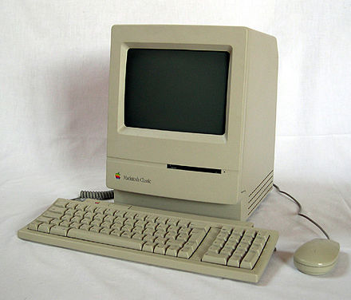

# Macintosh-Classic

My favorite classic computer is the Macintosh Classic, the first Macintosh to sell for less than **$1,000 US dollars**. It was manufactured from **October 1990 to September 1992**, and was of very high quality. It is my favourite only second to my current computer, the MacBook Pro. This computer was the best of its time, with amazing quality and excellent price.

# The Specs Compared 

| Specs  |  Macintosh Classic |  MacBook Pro 2019 |
| ------       | -------------| ------------------|
|  CPU      | MC68000       |  6-Core Intel COre i7 |
|  CPU Speed   | 8 MHz        |    2.6 GHz     |
|  RAM      | 1 MB, expandable to 2 or 4 MB |  16 GB |
|  Disk Space|   40 MB         |    512 GB        |
|  GPU       |     9-inch monochrome CRT           |    AMD Radeon Pro 5500M | 
| Hard Drive  | 40 MB SCSI |  1 TB SSD     

# Price
* US$999
* US$1,499 with 40 MB hard disk and 2 MB RAM

A lot of users have criticized 'the low processor performance and the lack of the slot' Christophe Dernbach points out,
> The price point and the simplicity of the product make up for that

# Review
[Macintosh Classic Review](https://www.youtube.com/watch?v=iI9e1dWzwp4&ab_channel=VWestlife)
